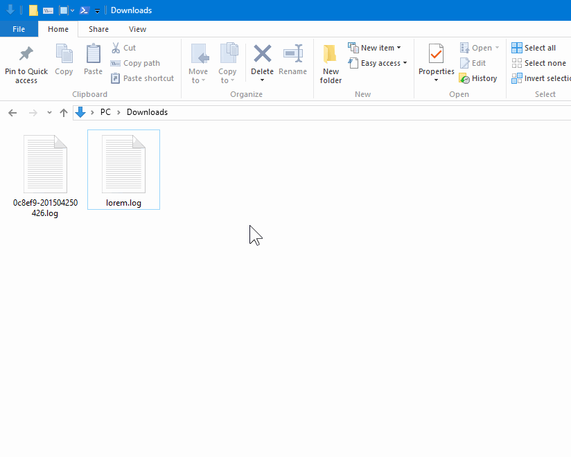

# Open W3C extended format log file with Excel

[](https://ci.appveyor.com/project/jsakamoto/openw3clogwithexcel)  
[](http://clickonceget.azurewebsites.net/app/OpenW3CLogWithExcel)

## What's this? / これは何?

This application is a converter from W3C extended format text log file to Microsoft Excel 2007 format(.xslx) file.

このアプリケーションは、W3C 拡張形式のテキストログファイルを、Microsoft Excel 2007 形式(.xlsx) のファイルに変換します。




After associate this app with `.log` extension, if you double click `.log` file which is W3C extended format log file on Windows Explorer, then this app convert the log file to
.xlsx file as temporary and open it with Microsoft Excel. (When exit Microsoft Excel, the temporary .xlsx file will deleted by this app soon.)

拡張子 `.log` にこのアプリケーションを関連付けしたのち、Windows エクスプローラー上で W3C拡張形式の `.log` ファイルをダブルクリックすると、このアプリケーションはそのログファイルを .xlsx 形式の一時ファイルに変換して、Microsoft Excel でこれを開きます。(Microsoft Excel が終了すると、この .xlsx 一時ファイルはこのアプリケーションによって間もなく削除されます)

If the `.log` file is not W3C extended format, this app detect it and open it with "Open" verb with shell.

もし `.log` ファイルが W3C 拡張形式でなければ、このアプリケーションはそのことを察知し、シェルの "開く" 動詞でそのファイルを開きます。

## How to install / インストール方法

### ClickOnce

This application published as ClickOnce on ["ClickOnceGet" site](http://clickonceget.azurewebsites.net/).  
You can install via follow "ClickOnce" button with IE/Edge browser.

このアプリケーションは ["ClickOnceGet" サイト](http://clickonceget.azurewebsites.net/)にて ClickOnce アプリケーションとして公開しています。  
IE/Edge ブラウザで以下の "ClickOnce" ボタンをクリックすることでインストールできます。

[](http://clickonceget.azurewebsites.net/app/OpenW3CLogWithExcel)

### Install Manually / 手動でのインストール

#### 1. Download / ダウンロード

If you want to install maunally, please download this application from ["Release" page](https://github.com/jsakamoto/OpenW3CLogWithExcel/releases).

手動でのインストールを行うには、["Release" ページ](https://github.com/jsakamoto/OpenW3CLogWithExcel/releases) からアプリケーションをダウンロードしてください。

#### 2. Configure registory settings / レジストリ設定の構成

##### Example of registry configuration / レジストリ設定例

```
Windows Registry Editor Version 5.00

[HKEY_CLASSES_ROOT\txtfile\shell]
@="openw3clogwithexcel"

[HKEY_CLASSES_ROOT\txtfile\shell\openw3clogwithexcel]
@="Open W3C log with Excel"

[HKEY_CLASSES_ROOT\txtfile\shell\openw3clogwithexcel\command]
@="\"C:\\{REPLACE HERE WITH REAL PATH OF THE APPLICATION FILE}\\OpenW3CLogWithExcel.exe\" \"%1\""
```

## System Requirements / システム要件

- Windows 7 or later / Windows7 またはそれ以降
- Microsoft Excel 2007 or later / マイクロソフト Excel 2007 またはそれ以降
- .NET Framework 3.5 or later / .NET Framework 3.5 またはそれ以降

## License / ライセンス

[GNU General Public License v2.0](LICENSE)